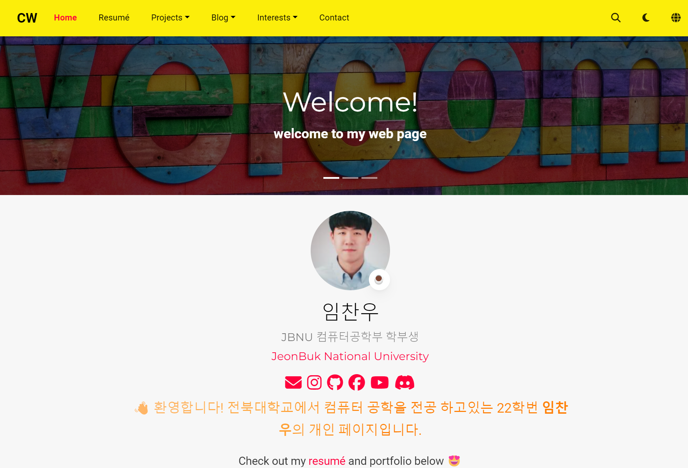

# [My Website with Hugo Theme](https://github.com/wowchemy/starter-hugo-portfolio-theme)

## 소개

이 웹사이트는 전북대학교에서 컴퓨터 과학을 전공하는 임찬우의 포트폴리오 사이트입니다. 웹사이트는 Hugo로 개발되었으며, 개인의 학업, 프로젝트, 경력 및 포트폴리오를 소개합니다. 주로 백엔드 개발에 중점을 둔 다양한 프로젝트와 경험을 포함하고 있습니다.

## 주요 기능

- **다국어 지원**: 기본 언어는 한국어로 설정되어 있으며, 직관적이고 사용하기 쉬운 인터페이스를 제공합니다.
- **반응형 디자인**: 다양한 화면 크기에서 최적화된 레이아웃을 제공하여, 데스크탑과 모바일 모두에서 잘 작동합니다.
- **경력 섹션**: 전북대학교와 관련된 경력 및 프로젝트에 대한 자세한 설명을 포함하고 있습니다.
- **슬라이더**: 페이지 상단에 이미지를 슬라이드쇼 형태로 표시하여 비주얼적으로 매력적인 경험을 제공합니다.
- **SEO 최적화**: Google Search Console을 통해 사이트맵이 제출되어 검색 엔진 최적화를 지원합니다.

## 기술 스택

- **Hugo**: 웹사이트는 정적 사이트 생성기인 Hugo를 사용하여 개발되었습니다.
- **SCSS**: 스타일링은 SCSS로 작성되었으며, 라이트 및 다크 테마를 지원합니다.
- **GitHub Pages**: GitHub Pages를 통해 웹사이트가 호스팅되고 있으며, 지속적인 배포를 지원합니다.
