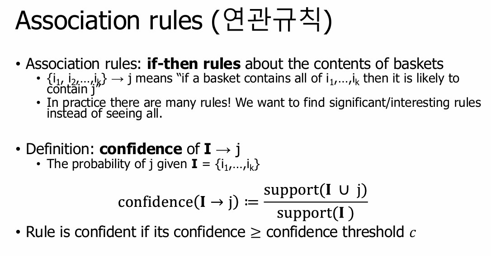

The A Priori algorithm is a classic algorithm for Association Rule Learning.

<!--more-->

**A Priori Algorithm**
- The A Priori algorithm is a classic algorithm used for Association Rule Learning, which is employed to discover useful patterns (primarily relationships between items) in large datasets. This algorithm is mainly used in market basket analysis to identify which products are frequently purchased together. The core concept is to find frequent itemsets and generate association rules based on them.

**Association Rule**

**How to find Association Rules?**
- To generate meaningful association rules from a dataset, metrics such as Support, Confidence, and Lift are used. Techniques like brute force, A Priori algorithm, and FP-growth algorithm are commonly employed.

**Learn more!** ==> https://blog.naver.com/dlacksdn86
