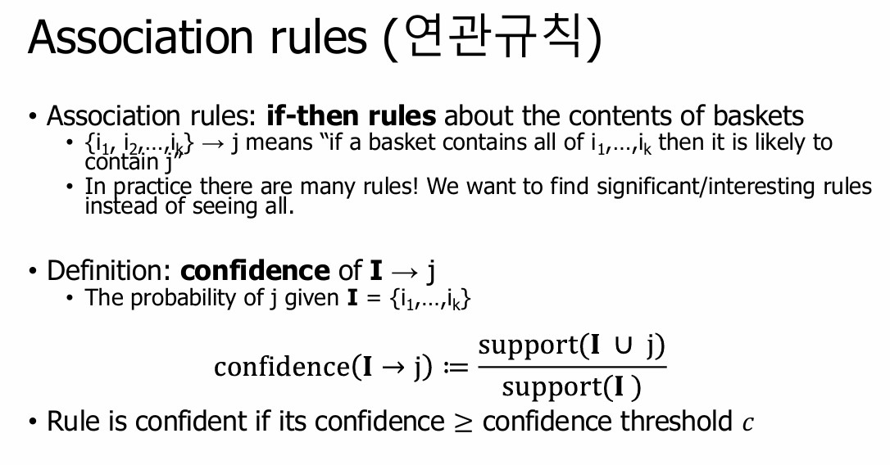

A Priori 알고리즘은 연관 규칙 학습(Association Rule Learning)을 위한 고전적인 알고리즘.

<!--more-->

**A priori 알고리즘**
- A Priori 알고리즘은 연관 규칙 학습(Association Rule Learning)을 위한 고전적인 알고리즘으로, 대규모 데이터에서 유용한 패턴(주로 항목 간의 연관성)을 발견하는 데 사용됩니다. 이 알고리즘은 주로 시장 장바구니 분석에서 사용되어, 어떤 제품이 함께 자주 구매되는지 파악하는 데 도움을 줍니다. 기본 개념은 자주 발생하는 항목 집합(Frequent Itemsets)을 찾고, 이를 바탕으로 연관 규칙을 생성하는 것

**Association Rule**

**Association Rule을 찾는 방법은?**
- Support, Confidence, Lift 3가지 척도를 이용해서 데이터셋으로부터 의미있는 association rule을 만들어내려면 brute force, apriori algorithm, FP-growth algorithm 등이 있다.

**Learn more!** ==> [Blog Posting](https://blog.naver.com/dlacksdn86)